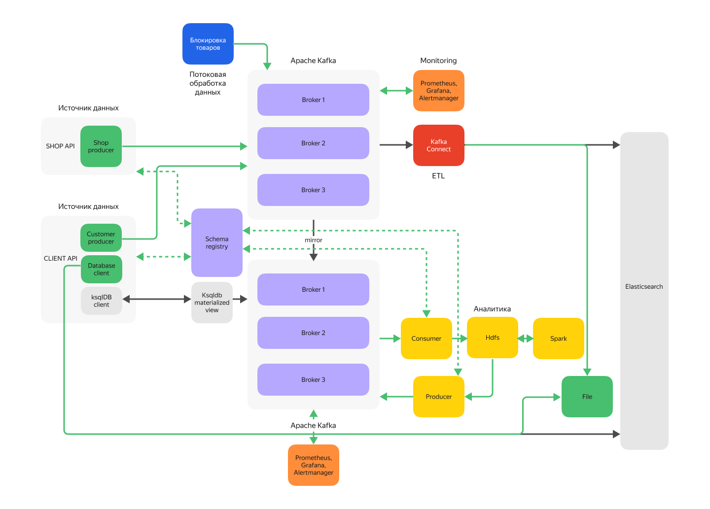
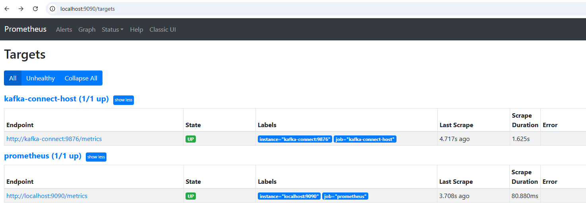

# Итоговый проект 
## Бизнес-контекст
«Покупай выгодно» — платформа электронной коммерции. Ближайшая цель маркетплейса — улучшить клиентский опыт и оптимизировать бизнес-процессы. Для этого команда хочет внедрить аналитическую платформу, которая будет собирать данные о взаимодействии клиентов с сайтом: просмотры товаров, добавление в корзину, покупки и отзывы. Полученную информацию будут обрабатывать алгоритмы машинного обучения — они выявят паттерны поведения и предпочтений клиентов.
В результате компания сможет показывать пользователям более релевантную рекламу, а также улучшить ассортимент товаров и качество обслуживания. Всё это повысит уровень удовлетворённости клиентов, увеличит конверсию и, как следствие, улучшит финансовые показатели компании.
###Архитектура системы
Тимлид и архитектор проекта продумали архитектуру системы.
Источники данных для системы — SHOP API и CLIENT API. SHOP API позволяет магазинам отправлять данные о товарах, CLIENT API предоставляет пользователям сервиса возможность выполнять запросы.
Связывать все сервисы платформы и обеспечивать надёжную передачу данных будет Apache Kafka. Данные от магазинов (SHOP API) будут попадать в кластер Kafka. Для безопасной передачи данных кластер планируется настроить с использованием TLS. Данные записываются в топики, которые должны быть закрыты для записи другим клиентам.
Для повышения надёжности и отказоустойчивости системы планируется реализовать репликацию данных, а также дублировать данные на второй кластер.
Аналитическая система будет перекладывать данные из второго кластера Kafka в Data Lake, реализованный на базе HDFS (Hadoop Distributed File System). На основе этого Data Lake тимлид и архитектор предлагают развернуть платформу Apache Spark, которая будет выполнять аналитические вычисления.
Обработчик в реальном времени должен проверять данные от магазинов и пропускать только разрешённые товары. Товары из списка запрещённых нужно фильтровать, обрабатывать их не надо. Обработчик будет подключён к основному кластеру Apache Kafka.
Для обеспечения надёжности и отслеживания производительности кластера Kafka нужно реализовать мониторинг; планируется интеграция с Prometheus и Grafana.
Для тестирования и отладки функций сервисов нужно организовать хранилище данных.
###Архитектура представлена на схеме ниже.
Серым отмечены необязательные элементы. Цветовая раскраска соответствует модулям курса.  


## Сборка проекта
 ```powershell
#запустите скрипт на выполнение
.\deploy.ps1
 ```

# 📊 Мониторинг
```
- **Kafka UI**: [http://localhost:8080](http://localhost:8080)
- **Kafka UI Destination**: [http://localhost:8082](http://localhost:8082) 
- **HDFS UI**: [http://localhost:9870](http://localhost:9870)
- **Spark UI**: [http://localhost:8081](http://localhost:8081)
```
#Hadoop
##Для Hadoop на Windows:
1. Установите переменную окружения HADOOP_HOME:
cmd
```
setx HADOOP_HOME "C:\hadoop"
```
2. Убедитесь, что путь ведет к корневой директории Hadoop (не включая \bin) .
3. Скачайте и установите winutils.exe:
4. Скачайте подходящую версию winutils.exe
5. Поместите его в директорию %HADOOP_HOME%\bin\
6. Убедитесь, что архитектура winutils.exe соответствует вашей системе (x64 или x86)
7. Установите свойство в коде:
java
```
System.setProperty("hadoop.home.dir", "C:\\hadoop");
```
Добавьте эту строку в начало вашего Java-кода перед любыми операциями с Hadoop .
Проверьте установку:
cmd
```
echo %HADOOP_HOME%
dir %HADOOP_HOME%\bin\winutils.exe
```

#SPARK 
(ВРЕМЕННО ЗАКОММЕНТИРОВАН, НЕТ МЕСТА, КОНФИГУРАЦИЯ ВЕРНАЯ, НА КОД НЕДОСТАТОЧНО РАЗРЕШЕНИЙ)
## HDFS - > Spark - > HDFS
запустите класс HDFSProcessing
## HDFS - > Kafka-destination
запустите класс HDFSToKafka

#SHOP API
## Добавление заблокированного товара
1. Добавьте в файл blocked_products.txt код товара, который должен быть заблокирован (уже заполнен для теста)
2. Запустите на выполнение класс shop/BlockedProductsProducer
3. В топике blockedProducts появится информация о заблокированных товарах
## Загрузка товара в базу
1. Дополните файл products.json тестовыми данными (уже заполнен для теста)
2. Запустите на выполнение класс shop/ProductFilterStream
3. В топике inputJsonStream появится вся информация из файла
4. В топике products появится информация обо всех товарах кроме заблокированных

#CLIENT API
##Запрос клиента:
Выполните команду с параметрами (пример простой аналитики):
1. фильтр по бренду
2. дата последнего изменения не позднее указанного количества месяцев
```
java -cp "C:/projects/KafkaSSlDemo/target/project_6-1.0-SNAPSHOT-jar-with-dependencies.jar" com.example.client.ProductParser "./connector-output/products-final.json" "XYZ" 1
```
В результате:
1. Запрос будет записан в топик **userQuery**
2. Результаты отправлены в топик **response**


# Prometheus
## проверить метрики
Убедитесь что у Prometheus есть доступ к kafka-connect-host. 
1. Перейдите в Prometheus. Для этого в браузере введите ссылку http://localhost:9090
2. Нажав на вкладку “Status”, выберите поле “Targets”. В окне вы должны увидеть 2 сервиса
prometheus и kafka-connect-host. У каждого статус = up, результат для prometheus:


http://localhost:9876/metrics
# Grafana
1. Для просмотра метрик запустите Grafana (login/pass admin/admin) **http://localhost:3000**
2. Импортируйте файл с настройками **./KafkaDebezium/grafana/dashboards/connect.json**